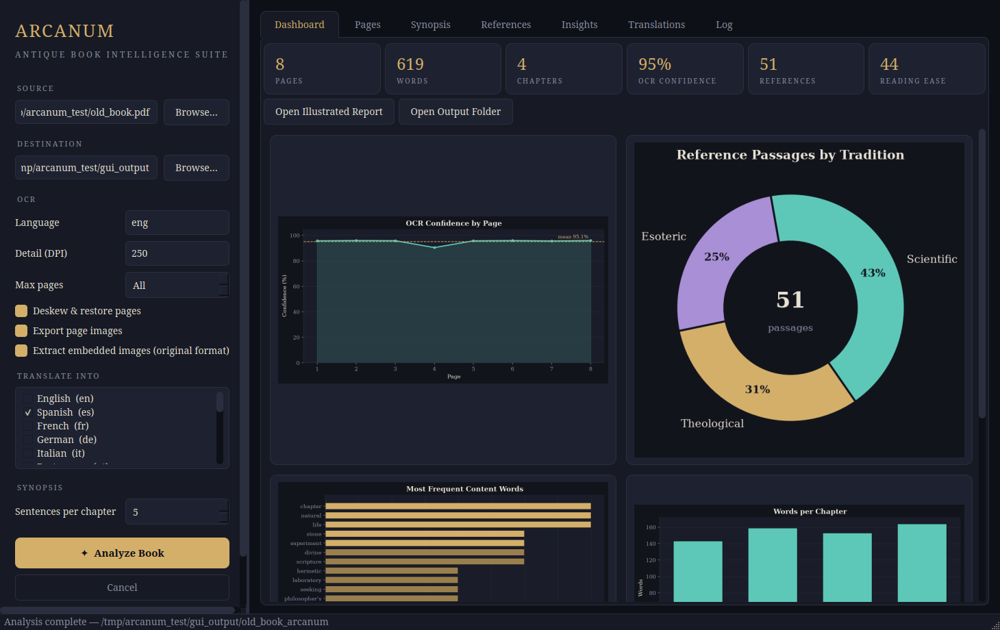

# Arcanum — Antique Book Intelligence Suite

Arcanum turns scans of old books into restored, searchable, translated and
deeply analyzed digital editions. Feed it a PDF of a scanned book; it
returns a cleaned searchable PDF, every page image (original and
restored), embedded illustrations in their original format, corrected
text, per-chapter synopses, mined esoteric / theological / scientific
references with verbatim excerpts, distilled insights, rich analytics
with publication-quality charts, and a self-contained illustrated HTML
report — all organized into one output folder.



## Features

- **Page restoration** — illumination flattening (removes yellowing,
  stains and uneven lighting), non-local-means denoising, automatic
  deskewing and contrast recovery, with before/after quality metrics.
- **Searchable cleaned PDF** — restored page images with an invisible
  OCR text layer (Tesseract), so the output PDF is fully text-searchable.
- **Image exports** — every page as original and restored PNG, plus all
  embedded raster images extracted in their original encoded format
  (JPEG, PNG, …).
- **Multi-language translation** — translate the corrected text and the
  chapter synopses into 19+ languages (source language auto-detected),
  with per-chunk retries against transient service errors.
- **Chapter synopses** — automatic chapter detection (CHAPTER IV, roman
  numerals, "Part the First", …) and frequency-based extractive
  summaries with keywords, per chapter.
- **Reference mining** — curated lexicons surface esoteric, theological
  and scientific passages, each with the verbatim excerpt, chapter and
  page range; passages blending two or more traditions are flagged as
  *syncretic*.
- **Insights** — dominant register, signature vocabulary per tradition,
  recurring names and phrases, reading level, structure, restoration
  gains and OCR weak spots.
- **Advanced analytics** — OCR confidence per page, words per chapter,
  reference density heatmaps, top-word distributions, restoration
  quality curves; exported as JSON and as styled PNG charts.
- **Illustrated report** — a single self-contained `report.html` with
  everything embedded, ready to archive or share.
- **Professional GUI** — dark parchment-and-gold PySide6 desktop app
  with input/output selectors, live progress, page before/after
  comparator, reference browser with excerpt reader, and an analytics
  dashboard. A full CLI is included for batch work.

## Installation

```bash
# 1. System dependency: the Tesseract OCR engine
sudo apt install tesseract-ocr            # Debian / Ubuntu
brew install tesseract                    # macOS
# Windows: https://github.com/UB-Mannheim/tesseract/wiki

# Extra OCR languages as needed, e.g. German + Latin:
sudo apt install tesseract-ocr-deu tesseract-ocr-lat

# 2. Python dependencies (Python 3.10+)
pip install -r requirements.txt
```

## Usage

### GUI

```bash
python app.py            # or: python -m arcanum --gui
```

Pick the scanned PDF, choose an output folder, tick any translation
languages, press **Analyze Book**. Results appear live in the Dashboard,
Pages, Synopsis, References, Insights and Translations tabs.

### Command line

```bash
python -m arcanum book.pdf -o ./out -t es -t fr        # translate to Spanish + French
python -m arcanum book.pdf -o ./out --dpi 300 --ocr-lang deu
python -m arcanum book.pdf -o ./out --max-pages 20     # quick preview run
python -m arcanum --list-languages                     # translation targets
```

## Ancient & classical languages

Reading an old book in another language involves two independent layers,
and both are configurable:

| Language | OCR (reads the script) | Machine translation (source) |
|---|---|---|
| Latin | `tesseract-ocr-lat` → `--ocr-lang lat` | ✓ `--from la` (or auto-detect) |
| Greek (modern) | `tesseract-ocr-ell` → `--ocr-lang ell` | ✓ `--from el` (or auto-detect) |
| Greek (ancient/polytonic) | `tesseract-ocr-grc` → `--ocr-lang grc` | ~ translated as modern Greek (`el`); good gist, not scholarly |
| Hebrew | `tesseract-ocr-heb` → `--ocr-lang heb` | ✓ `--from iw` (or auto-detect) |
| Aramaic (Syriac script) | `tesseract-ocr-syr` → `--ocr-lang syr` | ✗ not supported by the backend |
| Aramaic (Hebrew script, e.g. Targumim) | `tesseract-ocr-heb` → `--ocr-lang heb` | ✗/~ auto-detect treats it as Hebrew; rough at best |

Example — a scanned Latin treatise, translated into English:

```bash
sudo apt install tesseract-ocr-lat
python -m arcanum liber.pdf -o ./out --ocr-lang lat --from la -t en
```

Notes:

- **Auto-detect works well** for Latin, Greek and Hebrew; pass `--from`
  explicitly for short or mixed-language texts. Hebrew uses the
  backend's legacy code `iw` (`he` is accepted and normalized).
- **Aramaic**: the pipeline can OCR, clean and archive Aramaic text
  (`syr` for Syriac script, `heb` for Hebrew-script Aramaic), but no
  free machine-translation backend supports Aramaic — Arcanum reports
  this clearly instead of silently mistranslating. Use specialist
  scholarly tooling for the translation step.
- Tesseract languages can be **combined** with `+` for mixed-script
  books, e.g. `--ocr-lang lat+eng` or `--ocr-lang heb+syr`. The GUI's
  OCR language box is editable and accepts the same syntax.
- The esoteric/theological/scientific lexicons are English; to mine
  references from a non-English book, translate it into English
  (`-t en`) and the analysis of the original text still applies to
  structure, OCR quality and statistics.

## Output layout

```
<output>/<book>_arcanum/
├── report.html                     # self-contained illustrated report
├── cleaned/<book>_cleaned.pdf      # restored, searchable PDF
├── images/
│   ├── original/page_0001.png …    # pages as scanned
│   ├── cleaned/page_0001.png …     # restored pages
│   └── embedded/…                  # embedded images, original format
├── text/
│   ├── full_text.txt               # corrected OCR text
│   └── chapters/chapter_01.txt …
├── translations/<lang>/            # full text + synopses per language
├── synopsis/synopsis.md            # per-chapter synopsis + keywords
├── insights/insights.md            # distilled findings
├── references/
│   ├── esoteric.md / .json         # passages with excerpts & locations
│   ├── theological.md / .json
│   ├── scientific.md / .json
│   └── syncretic.md / .json        # passages blending traditions
└── analytics/
    ├── analytics.json              # every metric, machine-readable
    └── charts/*.png                # styled analytics charts
```

## Notes

- Translation uses the free Google Translate web endpoint via
  `deep-translator`; it needs network access and can be rate-limited on
  very large books. Failures are reported and never block the rest of
  the pipeline.
- OCR quality drives everything downstream. For very degraded scans,
  raise the DPI to 300–400 and install the right Tesseract language
  pack (`--ocr-lang`).
- A synthetic "aged scan" generator for testing lives in
  `tests/make_test_book.py`.
